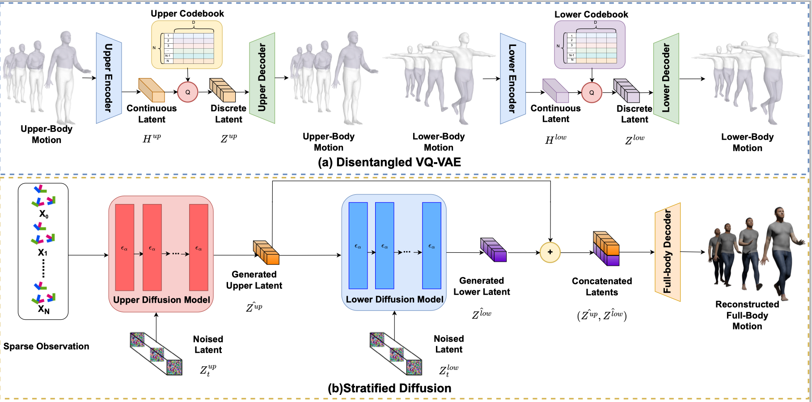
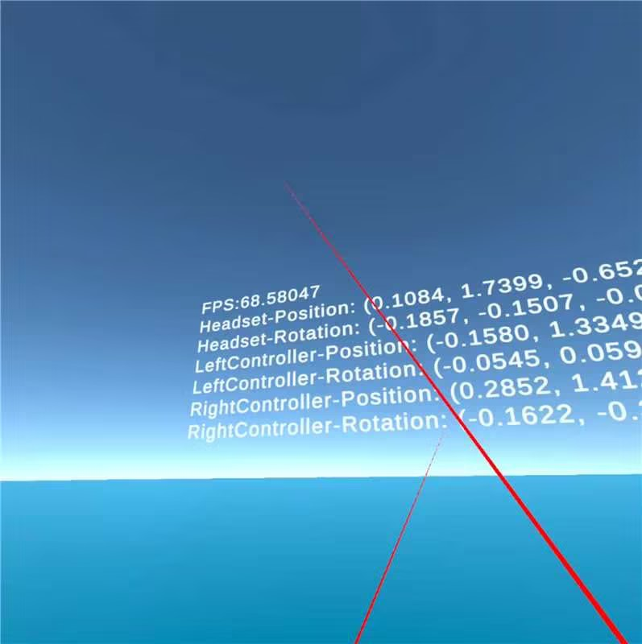
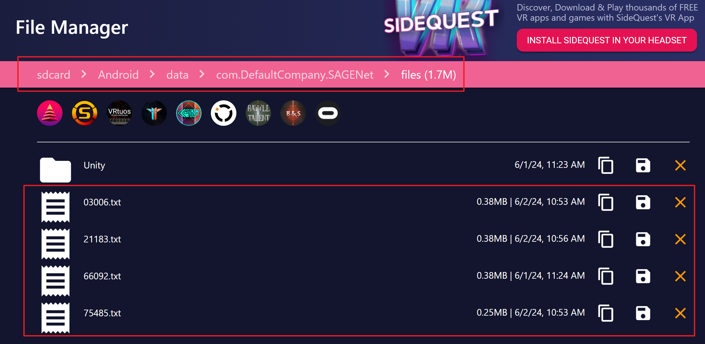

# Stratified Avatar Generation from Sparse Observations

This is the official implementation code of our CVPR 2024 paper. 

[[Paper](https://arxiv.org/abs/2405.20786)] [[Project page](https://fhan235.github.io/SAGENet/)]



## Environment

create the environment by running following instructions:

```bash
git clone https://github.com/Wenchao-M/SAGE.git
cd SAGE

# create a conda envirment named SAGE
conda create -n SAGE python=3.8
# activate the environment
conda activate SAGE
# You can modify the version of PyTorch or CUDA depending on your situation.
pip install torch==1.13.1+cu117 torchvision==0.14.1+cu117 torchaudio==0.13.1 --extra-index-url https://download.pytorch.org/whl/cu117
# install other python lib
pip install -r requirements.txt
```

## Dataset

1. Before using SAGE, **You must register** at SMPL(https://smpl.is.tue.mpg.de/index.html),
   SMPL-X(https://smpl-x.is.tue.mpg.de/index.html), AMASS(https://amass.is.tue.mpg.de/index.html)
   and agree with the LICENSE of them.

2. After registration, you can download the smplh and dmpls body model
   from [here](https://drive.google.com/file/d/1UOr2mknoE9uzelB_4moOhLB93RNXhEbm/view?usp=drive_link),
   and unzip it in your project directory, it should look like this:
    ```
    SAGENet
    ├─ body_models/
    ├─── dmpls/
    ├───── female/
    ├───── male/
    ├───── neutral/
    ├─── smplh/
    ├───── female/
    ├───── male/
    └───── neutral/
    ```
3. Download the dataset from [AMASS](https://amass.is.tue.mpg.de/download.php). In this repo, ACCAD, BMLmovi, BMLrub,
   CMU, EKUT, EyesJapanDataset, HDM05, HumanEva, KIT, MoSh, PosePrior, SFU, TotalCapture, Transitions are needed. (
   NOTE, only SMPL + HG are needed)
4. Unzip them in a directory.
5. Run prepare_data.py
   ```shell
   # before running, please replace raw_data_dir with the dataset dir you download before, 
   # replace path_you_want_to_save with the dir you want to save processed dataset.
   python prepare_data.py --support_dir body_models --root_dir /raw_data_dir --save_dir /path_you_want_to_save
   ```
6. If you save the processed dataset in another dir, you can use a symlink.
   ```shell
   ln -s /path_you_want_to_save dataset
   ```
7. The generated dataset should look like this
   ```
   SAGENet
   ├─dataset/
   ├─── ACCAD/
   ├───── 1.pt
   ├───── 2.pt
   ├───── ...
   ├─── BMLmovi/
   ├─── BioMotionLab_NTroje_test/
   ├─── BioMotionLab_NTroje_train/
   ├─── CMU_test/
   ├─── CMU_train/
   ├─── EKUT/
   ├─── Eyes_Japan_Dataset/
   ├─── HumanEva/
   ├─── KIT/
   ├─── MPI_HDM05_test/
   ├─── MPI_HDM05_train/
   ├─── MPI_Limits/
   ├─── MPI_mosh/
   ├─── SFU/
   ├─── TotalCapture/
   └─── Transitions_mocap/
   ```

## Evaluation Stage

#### Evaluate on the real capture demo

- **Before continuing, please remember to open the developer mode of Quest.**
- We provide an app to capture real motion sequences in Quest2. You can find it at realdemo/UnityProject/First3D/SAGENet.apk. You 
 can download and install it on Quest2 device. This is what the program looks like when it runs:



- This toy app starts recording data as soon as it is opened and
stops recording when it is exited. 
- After recording, you can find the data at Android/data/SAGENet/*****.txt



- We also open source the code of this toy app at real_demo/UnityProject/First3D
- After getting the data ****.txt, you can use the [process_quan.py](real_demo%2Fprocess_quan.py) to transform data into 
a coordinate system that the model can process.
- If you want to use our model in real demo, please download the weight from
[here](https://drive.google.com/file/d/1u5taAQ_Og9Wck-8eUhiiQi1s983y3Lws/view?usp=sharing).
- run `python inference_realdemo.py` to get the results, the results are pickle form like dataset-76610.pkl
- After getting the results, you can visulize it in Blender using [smpl_animation_blender.py](real_demo%2Fsmpl_animation_blender.py).
  - Notice that before using it, you must agree the license of SMPL and SMPLX.
  - To use [smpl_animation_blender.py](real_demo%2Fsmpl_animation_blender.py), you need to download SMPL Blender addon from [here](https://smpl.is.tue.mpg.de/download.php)
  - If you want the SMPL to have texture, please download the texture file from [here](https://github.com/Meshcapade/SMPL_texture_samples).
  - You project should look like this:
  - ```
    ├─ data/
    ├─── smpl-model-20200803.blend
    ├─── smpl_joint_regressor_male.npz
    ├─── smpl_joint_regressor_female.npz
    ├─── f_01_alb.002.png
    ├─── m_01_alb.002.png
    └─ smpl_animation_blender.py
    ```

#### Evaluate on the dataset

You can also download the weight under Setting 1
from [here](https://drive.google.com/file/d/1r_YN3jscvajvpUh1EcP8xfgkfWKkWlti/view?usp=drive_link), weight under Setting 2
from [here](https://drive.google.com/file/d/1u5taAQ_Og9Wck-8eUhiiQi1s983y3Lws/view?usp=sharing) and weight under Setting
3 from [here](https://drive.google.com/file/d/15bLlon43RzRidNx00p5NEmQjOnsjNBIU/view?usp=drive_link).
and unzip the weight into outputs dir, it should look like this
```
SAGENet
├─ outputs/
├─── upper_vqvae/
├───── best.pth.tar
├─── lower_vqvae/
├───── best.pth.tar
├─── decoder/
├───── best.pth.tar
├─── refiner/
└───── best.pth.tar
```

And run inference instruction

```shell
python test_refiner.py --cfg config_decoder/refiner.yaml
```

## Training Stage

If you want to retrain the model, please follow these commands sequentially.

You can train only specific parts of the model. For example, you can choose to skip retraining the
VQVAE stage and focus solely on training the diffusion stage and its subsequent stages.

#### VQVAE Stage

```bash
# NOTE:In VQVAE stage, training for the upper body and lower body can be conducted simultaneously.
CUDA_VISIBLE_DEVICES=0 python train_vqvae.py --cfg config_vqvae/upper_vqvae.yaml
CUDA_VISIBLE_DEVICES=0 python train_vqvae.py --cfg config_vqvae/lower_vqvae.yaml
```

#### Diffusion Stage

```bash
# NOTE:In Diffusion stage, lower body diffusion should be based on the upper diffusion model, so
# the following instructions must be executed sequentially.
# train the upper body diffusion model
CUDA_VISIBLE_DEVICES=0 python train_first.py --cfg config_diffusion/first.yaml
# train the lower body diffusion model
CUDA_VISIBLE_DEVICES=0 python train_second.py --cfg config_diffusion/second.yaml
```

#### Post Stage

```bash
# freeze the upper and lowewr diffusion model, train the decoder model
CUDA_VISIBLE_DEVICES=0 python train_decoder.py --cfg config_decoder/decoder.yaml
# (optional) train a RNN to smooth the result
CUDA_VISIBLE_DEVICES=0 python train_refiner.py --cfg config_decoder/refiner.yaml
```

[//]: # (## Future Work)

[//]: # (①Estimate the shape parameter to mitigate the height gap between different people thus )

[//]: # (enhance the user experience.)

[//]: # ()
[//]: # (②Incorporating egocentric images captured by VR headsets for modeling )

[//]: # (the whole body is definitely helpful, but there is still a lack of a corresponding dataset )

[//]: # (consisting of real images captured by a VR headset.)

#### For implementation details, please contact:
· wmm5390@psu.edu
· whuerfff@whu.edu.cn


## Acknowledgements

This project is built on source codes shared
by [body_visualizer](https://github.com/nghorbani/body_visualizer/tree/master/src/body_visualizer),
[human_body_prior](https://github.com/nghorbani/human_body_prior/tree/master/src/human_body_prior),
[AvatarPoser](https://github.com/eth-siplab/AvatarPoser), [AGRoL](https://github.com/facebookresearch/AGRoL),
[BoDiffusion](https://github.com/BCV-Uniandes/BoDiffusion).
We thank the authors for their great job!